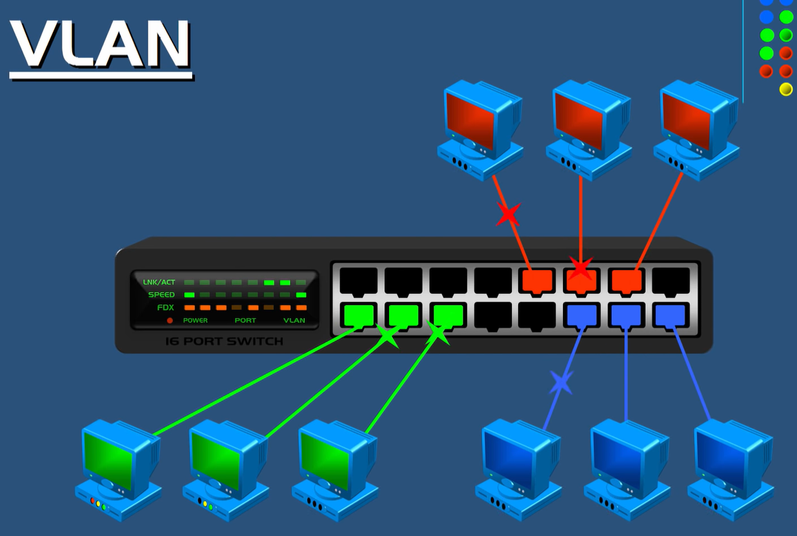

# CCNA Blog - Índice de temas

## [1. IP Connectivity](ip-connectivity.md)
- Routing table
- Static routing
- OSPF
- First Hop Redundancy Protocols

## [2. Network Fundamentals](network-fundamentals.md)
- OSI/TCP-IP
- IPv4/IPv6
- Subnetting & VLSM
- Wireless principles
- Switching concepts

## [3. Network Access](network-access.md)
- VLANs
- Trunking
- STP
- EtherChannel
- Wireless LANs

## [4. Security Fundamentals](security.md)
- ACLs
- VPNs
- AAA
- Wireless security

## [5. IP Services](ip-services.md)
- DHCP
- DNS
- NTP
- SNMP
- Syslog

## [6. Automation & Programmability](automation.md)
- SDN
- APIs
- Python
- JSON


***
## ESTAMOS APRENDIENDO MARKDOWN

***
# TITULOS

# Mi titulo h1
## Mi titulo h2
### mi titulo h3
#### MI titulo h4
##### Mi titulo h5
###### Mi titulo h6

### TEXTO EN ITALICA

this is an *Italic* text
this is an **strong** text
esto es un ~~texto tachado~~


### listas Ordenadas

* Apple
	* Apple 2
* Orange
	* Orange 2 

1. Apple 
	1. Apple2
2. Orange

### ENLACES MARK DOWN

[BreaknFix](https://www.google.com)
[BreaknFix](https://www.google.com "esta es mi pagina web en Github")

<!-- Colores en md con HTML -->


<span class="color:red; font-weight:bold;">Este texto es importante </span>    

<!-- Citas -->

> Esta es una cita


<!-- Esta es una linea horizontal -->


***
---
___


<!-- Texto, codigo programacion o comandos -->


```shell  
switch>enable               # Exec de Usuario
switch#configure terminal   # Privilegiado 
switch(config)#             # Configuracion Global

```


<!-- TABLAS -->

| TABLAS | ARE  |
|--------| -----| 
|        |      |


<!-- IMAGENES -->

### VLANS

    

Funcionalidad: 


****
+++
title = "Tema CCNA: [Nombre del tema]"
date = YYYY-MM-DD
tags = ["CCNA", "Networking", "JeremyITLab"]
+++

# [Nombre del tema]

## Apuntes (Notas principales)
- Punto clave 1
- Punto clave 2
- Comando importante: `switch>enable`

## Pistas (Keywords / Preguntas)
- ¿Qué significa este comando?
- ¿Qué diferencia hay entre modo usuario y privilegiado?
- ¿Cómo se configura una VLAN?

## Resumen
Breve explicación del tema en tus propias palabras.  
Ejemplo: *Las VLANs permiten segmentar una red física en varias redes lógicas, mejorando seguridad y administración.*

## Diagramas / Imágenes


## Comandos Cisco

```shell

switch>enable
switch#configure terminal
switch(config)#interface vlan 1

```


****


---

## 🚀 Cómo usarlo en tu repo
- Cada tema del curso Jeremy IT Lab → un archivo `.md`.
- Carpeta `img/` → guarda diagramas y capturas.
- Usa `tags` en el front matter para agrupar por módulos (ej. *Routing*, *Switching*, *Security*).
- Al final de cada módulo, puedes hacer un **resumen Cornell global** para repaso.

---

Esto convierte tu **travesía CCNA** en un proyecto vivo:  
- Aprendes, documentas y refuerzas.  
- Dejas un recurso modular que otros pueden usar.  
- Escalas fácilmente a GitHub Pages si quieres publicarlo como sitio.

👉 ¿Quieres que te arme un **ejemplo completo** con un tema real del curso (por ejemplo *OSPF básico*) usando esta plantilla Cornell?


***

***

¡Exacto, Oscar! Si quieres que tus **hashtags sean enlaces clicables** dentro de tu documentación en Markdown, puedes hacerlo de dos maneras:

---

### 🔗 1. Hashtags como enlaces internos (a otros `.md` de tu repo)
```markdown
[#CCNA](../temas/ccna.md)  
[#OSPF](../temas/ospf.md)  
[#Switching](../temas/switching.md)
```

👉 Cada hashtag apunta a otro archivo Markdown dentro de tu repositorio.  
Así, cuando alguien lea tu nota y haga clic en `#OSPF`, saltará al tema correspondiente.

---

### 🌐 2. Hashtags como enlaces externos (a sitios web)
```markdown
[#Cisco](https://www.cisco.com/)  
[#JeremyITLab](https://jeremysitlab.com/)  
[#Networking](https://en.wikipedia.org/wiki/Computer_network)
```

👉 Aquí los hashtags llevan a recursos externos, como la web oficial de Cisco o documentación de referencia.

---

### 🧪 Ejemplo aplicado a tu ruta CCNA
```markdown
## Resumen del tema

OSPF es un protocolo de enrutamiento dinámico basado en estado de enlace.  
[#CCNA](../temas/ccna.md) | [#OSPF](../temas/ospf.md) | [#Routing](../temas/routing.md)
```

👉 Al final de cada tema, puedes poner una “barra de hashtags” que actúe como índice navegable.

---

⚡ Esto convierte tus hashtags en un **sistema de etiquetas Cornell-style**, donde cada palabra clave es un enlace rápido a tus notas de repaso.  

¿Quieres que te arme un **mini índice global de hashtags** para tu repo CCNA, que funcione como mapa de navegación modular?


```bash
este es mi codigo para Cisco
```

<!-- TO-DO -->

<p> 
este es mi parrafo

este es mi parrafo 2
</p>

* [x ] Task 1
* [ ] Task 2 